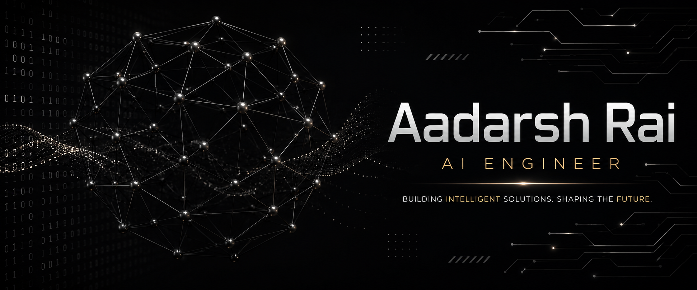

# About Me

I am an aspiring **AI and Machine Learning Engineer** focused on building practical, production-oriented machine learning systems and intelligent applications. My experience spans machine learning, deep learning, NLP, computer vision, data engineering, web development, and model deployment.

I specialize in developing end-to-end solutions—from data collection and preprocessing to model training, evaluation, API development, and deployment. I have hands-on experience with **Python, TensorFlow, Scikit-learn, Flask, FastAPI, MongoDB, MLflow, Docker, Playwright, and cloud deployment**, with a particular interest in building reliable systems that solve real-world problems.

## Selected Projects

### [MarketPulse](https://github.com/Aadarshrai1801/market-pulse)

**Real-Time Supermarket Price Intelligence Platform**

* **Core Technology**: Python, Flask, Playwright, MongoDB, JavaScript, HTML/CSS
* **Description**: A price intelligence platform that collects and analyzes product prices across major UAE supermarkets to help users compare prices and track market trends.
* **Key Features**:

  * Automates product discovery and price extraction across Carrefour, Lulu, Kibsons, Union Coop, and Barakat.
  * Uses Playwright-based scraping pipelines to handle dynamic e-commerce websites.
  * Normalizes product weights and prices into comparable **price-per-kilogram** metrics.
  * Stores historical pricing data in MongoDB for price tracking and analysis.
  * Provides APIs for asynchronous scraping jobs, historical data, and product metadata.
  * Implements price-change tracking to identify increases and decreases over time.
  * Designed with deployment constraints in mind, including browser automation and memory optimization for cloud environments.

### [Plantix](https://github.com/Aadarshrai1801/Plantix)

**AI-Powered Plant Disease Detection System**

* **Core Technology**: Python, TensorFlow, Deep Learning
* **Description**: An intelligent computer system designed to analyze plants images and find disease present in them.
* **Key Features**:

  * Uses deep learning models for image-based classification and prediction.
  * Uses GPU-accelerated training workflows for computationally intensive deep learning workloads.
  * Designed as an end-to-end pipeline from image preprocessing through model inference.

### [IntelliCast](https://github.com/Aadarshrai1801/Intellicast)

**AI-Powered Medical Chatbot & Healthcare Assistant**

- **Core Technology**: Python, NLP, Large Language Models, RAG, Streamlit, Vector Database
- **Description**: An intelligent medical chatbot designed to provide users with conversational healthcare information by understanding natural-language queries and retrieving relevant medical knowledge.
- **Key Features**:
  
  * Uses NLP and LLM-based techniques to understand and respond to medical queries.
  * Implements Retrieval-Augmented Generation (RAG) for context-aware and knowledge-grounded responses.
  * Integrates a medical knowledge base with semantic search for relevant information retrieval.
  * Provides an interactive conversational interface for users through Streamlit.
  * Delivers informative, accessible, and contextually relevant healthcare guidance.

### [QuickShow](https://github.com/Aadarshrai1801/QuickShow)

**Full-Stack Movie Ticket Booking Platform**

* **Core Technology**: MERN Stack, React, Node.js, Express, MongoDB
* **Description**: A full-stack movie ticket booking platform designed to provide users with a streamlined experience for discovering movies and managing bookings.
* **Key Features**:

  * Implements a modern React-based frontend for browsing and interacting with movie content.
  * Uses Node.js and Express for backend API development.
  * Integrates MongoDB for persistent application data.
  * Implements user-oriented booking and movie management workflows.
  * Demonstrates full-stack application development from frontend interface to backend services.

## Technical Proficiency

**Languages**
    

**Frameworks & Libraries**
    

**Cloud & Infrastructure**
    

## GitHub Activity

I use GitHub to document and build projects across **machine learning, artificial intelligence, web development, automation, and data-driven applications**. My repositories focus on practical implementations and end-to-end systems rather than isolated experiments.
